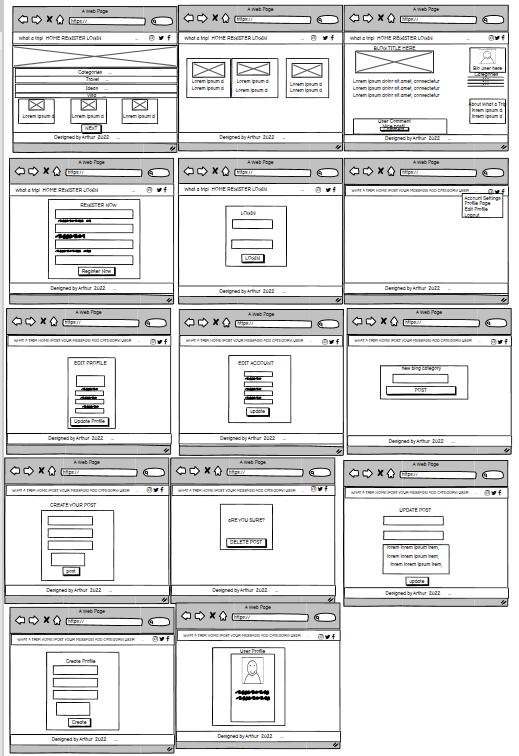
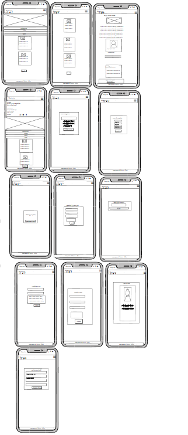
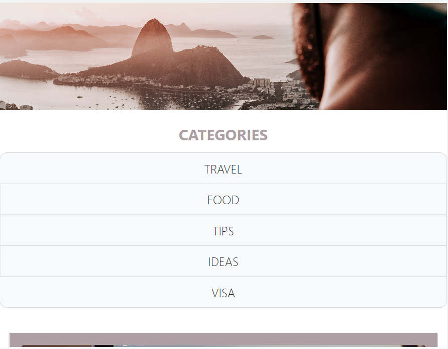
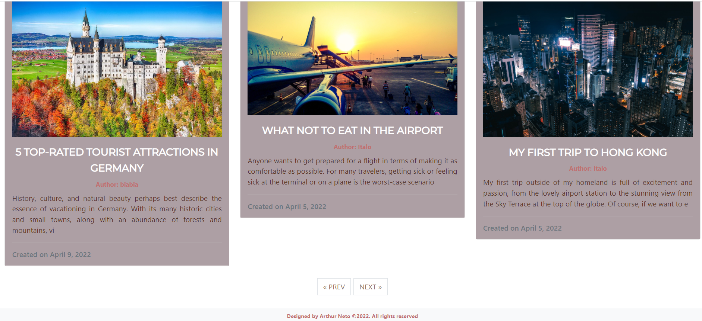
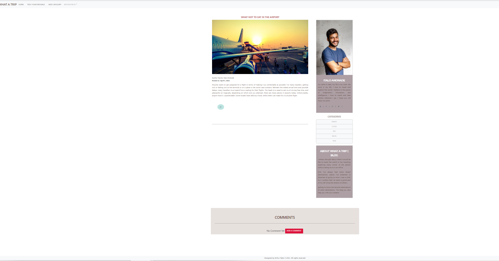
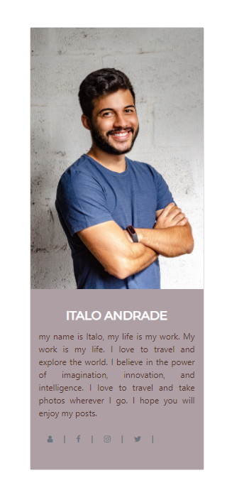
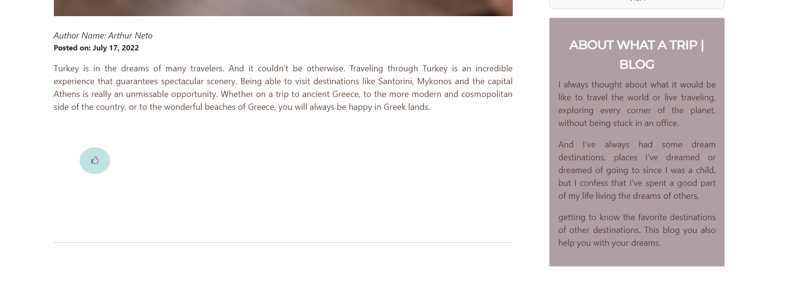
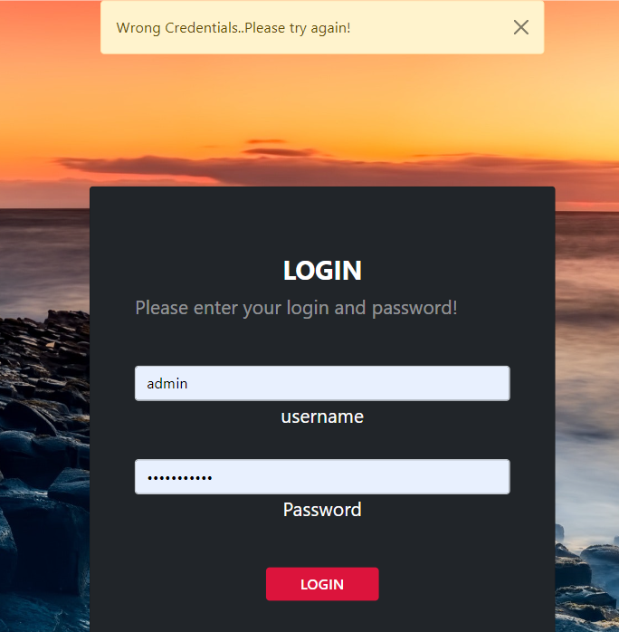

# What a Trip|Blog  Milestone Django Project. 

What a Trip is a contemporary vision of a user who has decided to travel  all over the world and is interested in sharing tips and experiences with some other travellers.

## Objective
My 4th Milestone project is an E-commerce Django project. This project shows the knowledge I acquired during the course. The skills learned in the modules that led to this project, include HTML Fundamentals, CSS Fundamentals, JavaScript, Interactive Frontend Development, Python, Data-Centric Development, User-Centric Development, and Django. Adding Django to my skill set; I developed a blog that allows the user to interact with an efficient website.

Check out App Deployed on Heroku[here](https://blogtravel-django.herokuapp.com/)

## UI/UX
## Project goals

The website's user interface (UX) was designed with simplicity in mind. The app is fully functional on all screen sizes, including 1400px, 1200px, 992px, 768px, and 576px, with comprehensive examination for each functionality.

The goal of this assignment is to create a web interface that allows users to simply store and access and performance the CRUD (Create, Read, Update, and Delete) actions. This project's goal is to allow users to create, store, modify, and remove posts (CRUD). People that are interested in topics such as travel or planning to live abroad are the target audience for this initiative. Users can create new categories, which greatly expands the reach of the blog's conversation topics.

#### User Stories:
As a user, I want:
*	Be able to launch the site on my preferred device (mobile, tablet, desktop).
*	Be able to view posts and comments created by other users without creating an account.
*	Be able to read selected blog posts. 
*	Be able to select category according to my interest.
*	Be able to create a user account.
*	Be able create user profile and bio. 
*	Be able to create a new category.
*	Be able to upload my picture and media.
*	Be able to link my social media to my profile.
*	Be able to view other users profile.
	Be able to not need to upload pictures in order to create a post.
*	Be able to edit my profile.
*	Be able to change my password and personal information.
*	Be able to edit and delete my posts.
*	Be able to like and dislike other users posts.
*	Be able to create a comment on others page. 
*	Be able to logout.

 This blog is informative and well-communicated with the user, with excellent UX and accessibility turning into a great blog for navigation.

## Wireframe

This site was built using ideas from preliminary wireframes created in Figma, and the image files exported from these are shown below. This website allows users to browse using a tablet, desktop, or mobile phone.

 - Tablet
  

  

  

## Colour Scheme

To produce distinct brilliant hues, I chose to just utilize a unique and eye-catching key color palette. The color scheme is as follows:

### Features

#	Navbar:
The navigation bar is at the top, with a logo that functions as a button and takes the user to the homepage.Navabar provides an option to register for new users, as well as the ability to login for those who already have an account. This blog's accessible social networks are listed on the right side of the navbar.

The navbar will display the functionality to create a post and add a category after the access has been created (if the user still doesn't have an account) and logged in.

The user will have accessibility to a dropdown menu that contains Account preferences, Profile Page, Edit Profile, and Logout.

For a good user experience, a dropdown button will keep all menu options open and easily accessible for browsing when the blog is viewed on a smaller device such as a tablet or smartphone.

## Footer
The footer I selected was a sticky footer, and I kept it simple by presenting copyright details.

## Main Page Element

Below the contents of the container there is a photo, the user will find the category section with each new category created, this list will grow and appear below the main image. Each selected 
Category will display cards with the chosen subject blog. 

* Post Section- by default the large containers will be displayed with the title/author name /snippet of the content from each blog post and the date published. For more than three box sections the button next will be available below the cards for user access to older content.

On each individual post page, the user will have access to the full article. 

* In each article, the post owner's profile bio will appear with their details and social networks.

## Features
At the bottom of each article blog the like/dislike option will be available for registered users.

The option to edit and delete post will only be available to those who created the post.

#Unregistered users can read the comments, but only registered users are allowed to make comments on the posts.

## Error message

Error message in case user is not logged in and try to add a post. 

Error message in case unregistered user try to add comment.

## User Profile 

Users can view the bio profile of other users on their social networks if available. If a profile photo is not uploaded when creating the profile, a default image will appear.

Login Page – Login form to input username and Password, however, register now link is also available below the form.

Not allowed to login due to incorrect username/password.

=======

## Register Page

Register form required personal details in order to create a new account. In case user has already created an account there is a login link below the submit button.

## Account setting – 

* User can edit personal details such as username, first name, last name and email address. 

* Change Password page- User can also change their password. 

 ## Features left to Implement
Add comment section for user not registered and be able for they can reply to the other comments. 

## Tools/Technologies
*	GitPod
*	GitPodw hosted my Workspace for this project
*	Git
*	used to push and commit any and all changes to my repository on GitHub
*	Bootstrap
*	Installed as a dependency Provided my buttons, modals, Navbar, footer, table and basic grid structure.
*	Also used django-bootstrap-forms
*	JQuery
*	The project uses JQuery for DOM manipulation (Ex: Modal)
SQLite
*	used as my local database until I engaged Database Url for Postgres
*	Heroku
*	Deployment of my Blog
*	Postgres
*	Database used in Heroku after deployment
Testing
Automated Testing
*	Validation Services
*	W3C Markup Validator was used to validate my HTML code.
*	W3C CSS Validator was used to validate my CSS code.

Deployment

Deployment instructions assume that you have already set up your repository and basic flask application. The website is deployed on the Heroku cloud platform using the following steps:
1. Create the necessary files for deployment
2. Create a requirements file using pip3 freeze > requirements.txt which will contain the required dependencies.
3. Create Procfile using echo web: python app.py > Procfile.
4. Push both files to GitHub
5. log in to Heroku and create a new app
6. Connect the app to your project
7. Go to the deployment method section and choose the method. If using GitHub, select that option, otherwise use the Heroku CLI method.
8. Following the GitHub method, search for the desired repository and connect to it
9. Enter configuration variables
10. Go to the settings tab and select Reveal Config Vars. Enter the variables defined in the env.py file (IP, PORT and SECRET_KEY).
11. Deploy and preview
12. Go back to the deployment tab and enable automatic deployment.
13. Finally, press deploys branch and preview your website.

=======

## Register Page

Register form required personal details in order to create a new account. In case user has already created an account there is a login link below the submit button.

## Account setting – 

* User can edit personal details such as username, first name, last name and email address. 

* Change Password page- User can also change their password. 

 ## Features left to Implement
Add comment section for user not registered and be able for they can reply to the other comments. 

## Tools/Technologies
*	GitPod
*	GitPodw hosted my Workspace for this project
*	Git
*	used to push and commit any and all changes to my repository on GitHub
*	Bootstrap
*	Installed as a dependency Provided my buttons, modals, Navbar, footer, table and basic grid structure.
*	Also used django-bootstrap-forms
*	JQuery
*	The project uses JQuery for DOM manipulation (Ex: Modal)
SQLite
*	used as my local database until I engaged Database Url for Postgres
*	Heroku
*	Deployment of my Blog
*	Postgres
*	Database used in Heroku after deployment
Testing
Automated Testing
*	Validation Services
*	W3C Markup Validator was used to validate my HTML code.
*	W3C CSS Validator was used to validate my CSS code.

Deployment

Deployment instructions assume that you have already set up your repository and basic flask application. The website is deployed on the Heroku cloud platform using the following steps:
1. Create the necessary files for deployment
2. Create a requirements file using pip3 freeze > requirements.txt which will contain the required dependencies.
3. Create Procfile using echo web: python app.py > Procfile.
4. Push both files to GitHub
5. log in to Heroku and create a new app
6. Connect the app to your project
7. Go to the deployment method section and choose the method. If using GitHub, select that option, otherwise use the Heroku CLI method.
8. Following the GitHub method, search for the desired repository and connect to it
9. Enter configuration variables
10. Go to the settings tab and select Reveal Config Vars. Enter the variables defined in the env.py file (IP, PORT and SECRET_KEY).
11. Deploy and preview
12. Go back to the deployment tab and enable automatic deployment.
13. Finally, press deploys branch and preview your website.

Issues Encountered
- I had some difficulties in finding the correct media query resolutions for my page, but in the end I managed to make the content adapt to each different screen.
Outcome
- I was able to construct my first website using all of the material supplied during the course and with the aid of my mentor. I am pleased with the outcome.
>>>>>>> 4daa1e70a5a3bd5f74cf92c47a58a4de539ad2a5
